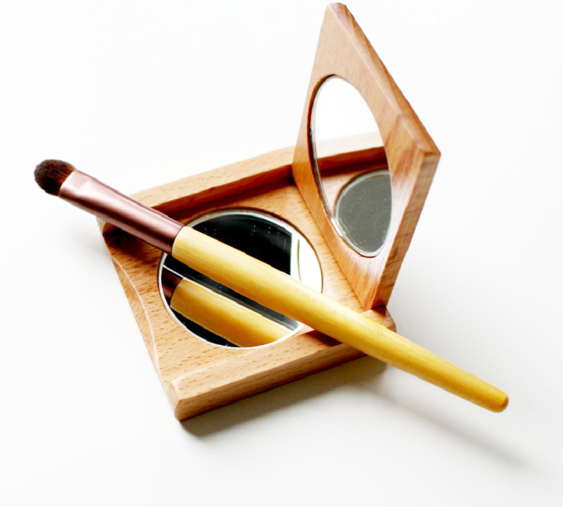

# INTEGRACIÓN DE CONTENIDO INTERACTIVO

    SOFIA VALERA FERNÁNDEZ

Contenido

INTEGRACIÓN DE CONTENIDO INTERACTIVO

INTRODUCCION

CARRUSEL

EFECTO AL HACER SCROLL

MICROINTERACCIONES

- Producto que se disminuye al posicionarse encima

- Al colocarte encima de los comentarios salga una sombra gris

- Aumentan los iconos de las redes sociales al posicionarte encima

- Flecha que detecta scroll y al tocarla te lleva al principio de la pagina

- Carrito de la compra que rote al posicionarse encima

MENU DE NAVEGACION

IMÁGENES

AVISO COOKIES

## INTRODUCCION

La práctica trata sobre la integración de contenido interactivo en la página web. La cual se va dividir en 3 partes: **HTML, CSS, JS.** Voy a explicar a continuación las características que he ido añadiendo a la página web, basándome en la rúbrica:

## CARRUSEL

**Incluir un carrusel de al menos tres imágenes de productos destacados en la sección de novedades y promociones de la página principal de la interfaz del escaparate virtual.**

**INDEX.HTML**

La clase que compone todo el carrusel se llama **&quot;slideshow&quot;,** el cual este contenido en un grid de 12 columnas. Dentro de la clase **&quot;slideshow&quot;** , nos encontramos con una lista desordenada, que en cada ítem tiene su respectiva imagen, he añadido cuatro imágenes, tres de ellas tienen una sección con texto.

Después tenemos una lista ordenada que son los círculos, que se muestran abajo del carrusel que al hacer click en ellos nos llevan a la imagen que corresponde con ese círculo, que se pueden hacer manualmente poniendo 4, o la forma correcta que es como lo implemento que es con JavaScript reconociendo la longitud.

A continuación de estos tenemos dos divs con las respectivas flechas izquierda y derecha, que son iconos sacados de &quot; **Font Awesome**&quot;, la funcionalidad de las flechas es poder cambiar de imagen.

Toda la funcionalidad se hará con javascript y los estilos con css, lo muestro a continuación.

**CARRUSEL.CSS**

Es un css bastante extenso ya que le vamos dando estilos a todo el carrusel, esto es un resumen de algunos estilos que he dado, primeramente, ponemos toda la página con margin y padding 0, quitamos los estilos de lista, a los h1 les ponemos la misma tipografía que el logo, a las imágenes les asignamos un tamaño, y los ítems una anchura del 100%, a los círculos se les pone posición absoluta y se les asigna unos márgenes, una anchura y disposición flex, justificados.

Por ultimo las flechas se pone al igual que los círculos posición absoluta, altura 100%, margen de arriba 0, disposición flex, color gris, z-index:2, para que aparezcan por encima de las flechas y cursor puntero.

**CARRUSEL.JS**

Voy a darle funcionalidad a través de JQUERY, para que funcione hay que importar las librerías que nos hemos descargado a través de la página de JQuery al .html y este script también poniéndolo al final del body.

Nos creamos una serie de variables, la primera de ellas, **imgItems,** es para ver cuantos elementos hay, es decir cuántas imágenes. La otra variable creada **imgPos,** la posición de la imagen igual a 1.

Para hacerlo dinámico, aumentaremos el valor desde 1 hasta la longitud.

A través de **hide()** y **show()**, ocultamos o mostramos las imágenes.

Después tenemos que hacer el efecto de que los círculos cambien de color en este caso blanco cuando esta la imagen seleccionada, si no salgan en gris. A través de **$(&#39;.circulos li:first&#39;).css({&#39;color&#39;:&#39;white&#39;});**

Para hacer la funcionalidad que cuando se haga click se ejecuten, se llevara a cabo a través de tres funciones: **círculos, nextSlider, prevSlider**.

Por último, solo falta que sea automático, con intervalo que he puesto de 4 segundos o 4000 milisegundos. La función seria:

    setInterval(function(){

        nextSlider();

    }, 4000); //cada 4 segundos

## EFECTO AL HACER SCROLL

**Efecto al hacer scroll hacia abajo, la primera vez que se carga la página.**

El efecto de scroll, esta sacada la idea de un ejemplo que está en el foro. Para poder implementarlo se divide en tres partes index.html, scroll.css y scroll.css.

**INDEX.HTML**

Se divide en el **&lt;p&gt;** de &quot;comentarios clientes&quot; que es un grid\_12 y otro grid\_12 que son los comentarios que van a hacer el efecto scroll.

Con imagen, los iconos de las estrellas y el comentario.

    <!-- comentario 1 -->
    

      

        

          
        

      

      

        <i class="fa fa-star"></i>
        <i class="fa fa-star"></i>
        <i class="fa fa-star"></i>
        <i class="fa fa-star"></i>
        <i class="fa fa-star-half-o"></i>
      

      
<i class="fa fa-quote-left"></i> ¡¡Me encanta este sitio web!! <i class="fa fa-quote-right"></i>
      

    

**SCROLL.CSS**

Le asignamos los estilos con css. El tamaño de las letras, que sea un div redondeado, que al posicionarte encima salga una animación con sombra gris, que las imágenes sean redondas, donde se van a posicionar las estrellas, etc. En el css sale comentado que hace cada cosa.

**SCROLL.JS**

Tenemos al comenzar el JS esto $(document).ready, lo que hace es la de ejecutar funciones una vez cargada en su totalidad la página web (DOM).

La primera variable es, el $.find() es un método que nos permite buscar entre los descendientes de estos elementos en el árbol DOM y construir un nuevo objeto jQuery a partir de los elementos coincidentes.

La siguiente variable $(window), el objeto window representa una ventana abierta en un navegador.

Después comprobamos si hay contenedores de animación a la vista y obtenemos información de la ventana: altura, scroll de arriba, posición.

La parte del **else** la quitamos para que solo se muestre al recargar la primera vez la pagina y solo al hacer scroll hacia abajo.

## MICROINTERACCIONES

Hay diversas micro interacciones en las páginas index.html, vertodos.html y productos.html.

### Producto que se disminuye al posicionarse encima

**INDEX.HTML**

    <!--ImagenDeUnProductoDestacados-->
    

        <h2>Productos destacados</h2>
        

            
        

    
    

**MAIN.CSS o STYLE.SASS**

La animación se va a poner que se vea igual en Chrome, safari y Firefox. Para asegurarnos que se vea igual en todos los navegadores. Va a ser de 9 segundos despacio y va a tener una escala de transformación de 0.8.

    /*--PRODUCTOS-DESTACADOS-IMAGEN--*/
    .productos img{
        -webkit-transition:all .9s ease; /* Safari y Chrome */
        -moz-transition:all .9s ease; /* Firefox */
        cursor: none;
    }

    .productos:hover img{
        -webkit-transform:scale(0.8);
        -moz-transform:scale(0.8);
        transform:scale(0.8);
    }

### Al colocarte encima de los comentarios salga una sombra gris

**INDEX.HTML**

    <!-- comentario 1 -->
    

      

        

          
        

      

      

        <i class="fa fa-star"></i>
        <i class="fa fa-star"></i>
        <i class="fa fa-star"></i>
        <i class="fa fa-star"></i>
        <i class="fa fa-star-half-o"></i>
      

      
<i class="fa fa-quote-left"></i> ¡¡Me encanta este sitio web!! <i class="fa fa-quote-right"></i>
      

    

**SCROLL.CSS**

Para añadirle, ese efecto de sombra se debe escribir:

    .animation-element.slide-left.testimonial:hover,

    .animation-element.slide-left.testimonial:active{

       box-shadow: 0px 5px 10px 0px #E5E7E9;

    }

Y darle los segundos.

### Aumentan los iconos de las redes sociales al posicionarte encima

**INDEX.HTML**

Son tres imágenes de iconos de redes sociales:

    

        <ul class="icon">
            <li class="icon1">
                
            </li>
            <li class="icon2">
                
            </li>
            <li class="icon3">
                
            </li>
        </ul>
    
    

**MAIN.CSS o STYLE.CSS**

El CSS necesario para darle ese efecto a cada icono individual es:

    /*--Icono instagram--*/
    .icon .icon1 a img{
        -webkit-transition:all .9s ease; /* Safari y Chrome */
        -moz-transition:all .9s ease; /* Firefox */
        width:100%;
    }

    .icon1:hover a img{
        -webkit-transform:scale(1.25);
        -moz-transform:scale(1.25);
        transform:scale(1.25);
    }
    
Con cada icono, se le asigna unos segundos y la escala de transformación para que haga el efecto de ampliación.

### Flecha que detecta scroll y al hacer click en ella te lleva al principio de la pagina

Este efecto está implementando en las tres páginas .html.

**INDEX.HTML**

Al principio del index.html debajo de la búsqueda tengo creado un SPAN:

    

Que es donde se mostrara la flecha, pero para que se muestre al hacer scroll lo hare con JavaScript y CSS.

**FLECHA.JS**

En mi Script de flecha, voy a hacer que desaparezca cuando no hay scroll y que al hacer **click** suba arriba.

**MAIN.CSS o STYLE.SASS**

Le doy estilos para que aparezca semitransparente, en color gris, con cursor puntero, bordes redondos, …

### Carrito de la compra que rote al posicionarse encima

**INDEX.HTML**

El carrito aparece en el **header** de la página web:

     

          
     
  

Su interacción, es que al pulsar encima se va a mover para un lado. Lo haremos a través de CSS.

**MAIN.CSS o STYLE.SASS**

Al pocinionarse encima con hover, va a rotar -20 deg, el código es el siguiente:

    .carrito a img:hover{

       -webkit-transform: rotate(-20deg);

       -moz-transform: rotate(-20deg);

       -ms-transform: rotate(-20deg);

       transform: rotate(-20deg);

    }

## MENU DE NAVEGACION

Mi menú de navegación es un menú horizontal, el cual en tienda se despliega. El efecto que hace es que es fijo y al posicionarte encima crea una línea horizontal que se va degradando de blanco a gris.

Cuando seleccionamos **VERTODOS.html** o **PRODUCTOS.html** nos crea una sombra el menú, la cual en index.html, no aparece debido a que no queda muy bien estéticamente por el fondo negro. Seria añadir simplemente:

    box-shadow: 2px 3px 2px #616162;

**INDEX.HTML**

Lo llevo a cabo a través de una lista desordenada con sus ítems correspondientes.

    

        <ul>
            <li><a href="#">Home</a></li>
            <li class="menuDes"><a href="#">Tienda</a>
                <ul class="desplegable">
                    <li><a href="#">Cara</a></li>
                    <li><a href="#">Ojos</a></li>
                    <li><a href="#">Labios</a></li>
                </ul>
            </li>    
            <li><a href="#">A domicilio</a></li>
            <li><a href="#">Galeria</a></li>
        </ul>
    

**MAIN.CSS o STYLE.SASS**

Para hacer que este fijo pondré que tenga **posición fixed,** que sea **top 0** para que aparezca arriba y con **z-index: 99** , se va a superponer encima de todo.

Para hacer la animación de la **raya horizontal** , seria añadir estas sentencias al posicionarte encima:

    border-top: 1px;

    border-style: solid;

    border-color: grey;

    transition: 3s;

## IMÁGENES

Las imágenes tienen que tener varias funcionales. Donde hacemos uso de las funcionalidades que nos piden es en **vertodos.html** y en **producto.html.**

- Al poner el ratón encima debe mostrar _información del producto_ y tres **iconos like, fav y comentarios** y el número de veces de cada uno.

**VERTODOS.HTML**

En el archivo html creo la clase **&quot;effect-goliath&quot;,** que en css explicare lo que hace esta clase.

    

         <figure class="effect-goliath">
             
            <figcaption>
                
8,50€ &nbsp;&nbsp;&nbsp;&nbsp;&nbsp;&nbsp;&nbsp;
                <a href="#">40</a>
                <a href="#">3</a>
                <a href="#">1</a>
                

            </figcaption>
        </figure>  
     
  

**VERTODOS.CSS**

Desde css a través de la clase creada en el HTML le voy a dar el efecto de que se levante la imagen al posicionarte encima y que salgan los iconos con fondo morado semitransparente y el precio.

En la parte del css que sale es donde pone el comentario:

/\*--EFECTO IMAGENES--\*/

- Al hacer click sobre el producto de VERTODOS.html, se mostrarán los detalles del producto con la opción de compra y los iconos con el número de **likes** , **favoritos**** y share para compartirlo en las redes sociales. **Al hacer click o posicionarnos encima del producto en PRODUCTO.HTML nos volverá a aparecer en mi caso el carrito de la compra y share para enviarlo**.**

**PRODUCTO.HTML**

Creo la estructura de como van a ser los detalles del producto. Al posicionarme encima de la imagen, tengo la opción de enviar el producto y meter el producto al carrito.

Un botón de añadir al carro, y debajo de añadir al carro los **likes, favotitos y share**.

Todo ello aparece en la parte de: 
/\*--Detalles del producto--\*/

**PRODUCTO.CSS**

A través del producto le damos los estilos CSS correspondientes. Donde aparece:

/\*--GALERIA-PRODUCTOS---\*/

Le damos el estilo correspondiente al texto, las estrellas, el stock, precio nuevo y precio viejo, …

Para hacer el efecto de ocultar el texto se hará a través de JS. Le doy el estilo correspondiente y con JavaScript hago que aparezca o se oculte.

**DESCRIPCION.JS**

Con esta función se hace que se oculte o aparezca el texto:

    function mostrar(enla , etik) {  
      obj = document.getElementById(etik);  
        obj.style.display = (obj.style.display == 'block') ? 'none' : 'block';  
      enla.innerHTML = (enla.innerHTML == 'ocultar texto') ? '... seguir leyendo' : 'ocultar texto';  
    } 

## AVISO COOKIES

Al abrir index.html, nos aparece el mensaje de cookies ya que el index.html es la página principal. Cuando le doy a aceptar se quita el mensaje para que no sea intrusivo.

**INDEX.HTML**

Al final del index es donde colocamos estas sentencias:

    

        

            Solicitamos su permiso para obtener datos de su navegación, en cumplimiento del Real Decreto-ley 13/2012. Si continúa navegando consideramos que acepta el uso de cookies.
            <a href="javascript:void(0);" class="ok" onclick="ok();"><b>OK</b></a> | 
            <a href="http://politicadecookies.com" target="_blank" class="info">Más información</a>
        
    
    
  

**MAIN.CSS o STYLE.SASS**

Con CSS le doy los estilos necesarios para que se quede por encima del texto y en color semitransparente.

Las sentencias serian:

    position: fixed;

    background-color: rgba(0, 0, 0, 0.5);

    z-index: 99999;

**COOKIES.JS**

A través de esta función cuando pulsen en OK(), desaparecerá el mensaje.

    function ok(){

        document.getElementById(&quot;barraaceptacion&quot;).style.display=&quot;none&quot;;

    }